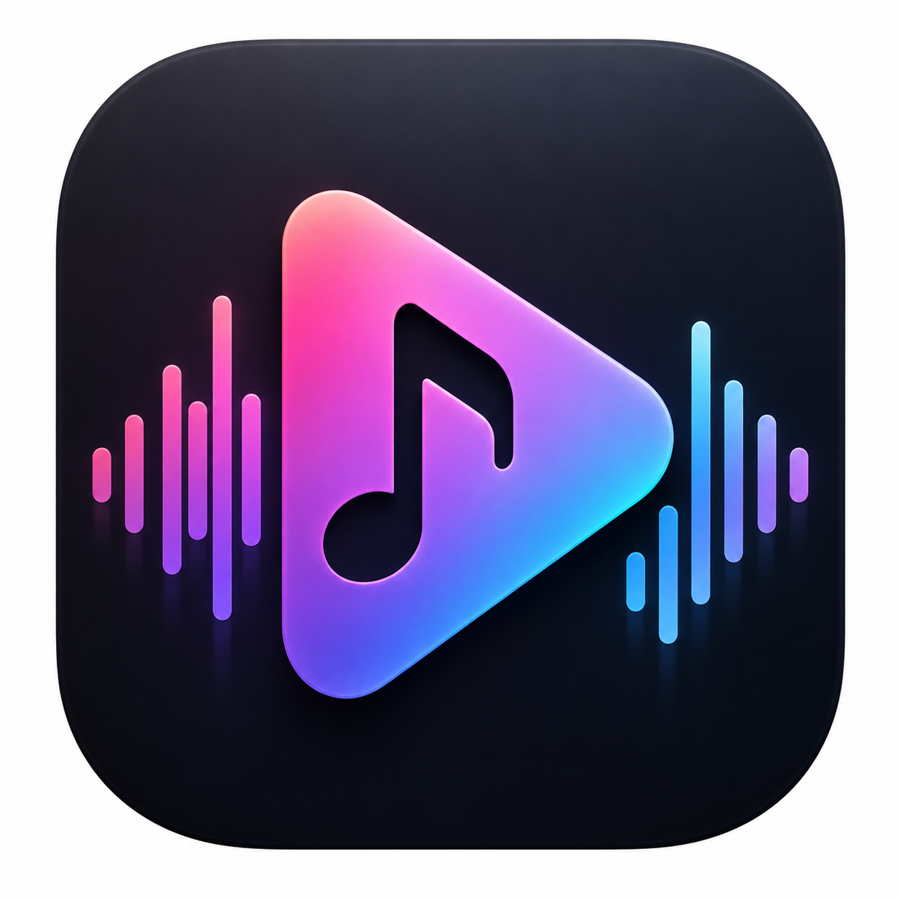

# SikaMTV

<div align="center">
  
  <p><strong>原生 macOS 音乐可视化歌词视频生成器</strong></p>
  <p>
    
    
    
    
  </p>
</div>

SikaMTV 用于将背景图片或视频、音乐和歌词快速合成为音乐视频。它提供实时预览、动态歌词、多种音频可视化和背景轮播效果，并可一键导出标准 MP4 文件。

项目采用 Swift 和 Apple 原生框架开发，不依赖 FFmpeg 或第三方运行时。

## 功能特性

### 背景与素材

- 支持一次导入多张图片或多个视频，并允许图片与视频混合使用。
- 根据音乐时长和素材数量自动安排每个背景的展示区间。
- 提供淡入淡出、横向滑动、缩放溶解和直接切换效果。
- 视频背景可自动循环；单视频循环点默认使用首尾交叉淡化，减少生硬跳切。静态图片可应用缓慢缩放，避免画面完全静止。
- 支持背景模糊、暗化和饱和度调节。

### 音频可视化

- 使用 Accelerate/vDSP 执行 4096 点 FFT，并生成 96 个频段。
- 提取响度、低中高频、节拍和波形等实时特征。
- 分析结果使用本地二进制缓存，减少重复加载和切换音频时的等待。
- 内置 Wave、Spectrum、Mirror、Circle 和 Ripple 可视化。
- 提供 Zen、Ethereal、Minimal、Cinema 和 Electronic 整体视觉模板。

### 歌词与字幕

- 支持标准 LRC 歌词和 SRT 字幕。
- 可自动查找与音频同名的歌词或字幕文件。
- 同时显示上一句、当前句和下一句，并突出当前歌词。
- 支持歌词字号、位置、行距、对齐、透明度和动画参数调节。
- 提供向上滚动、淡入淡出、缩放和无动画模式。
- 支持系统字体，以及用户导入的 TTF/OTF 字体。

### 预览与导出

- 支持 9:16、16:9 和 1:1 画面比例。
- 预览画布严格使用当前导出比例，确保所见即所得。
- 预览与最终视频共用同一套 `RenderEngine`。
- 默认导出 1080P、30 FPS、H.264 + AAC 的 MP4 视频。
- 导出完成后可直接播放视频或在 Finder 中显示。

## 使用流程

1. 导入一张或多张背景图片，也可以导入背景视频。
2. 导入 WAV、MP3、M4A 等格式的音乐。
3. 导入对应的 LRC 或 SRT 文件，或让应用自动匹配同名字幕。
4. 选择系统字体或导入自己的 TTF/OTF 字体。
5. 选择视觉模板，并按需要调整背景、可视化和歌词参数。
6. 选择输出比例，确认实时预览效果。
7. 点击“生成视频”并选择保存位置。

## 支持格式

| 类型 | 格式 |
| --- | --- |
| 背景图片 | JPG、JPEG、PNG、HEIC |
| 背景视频 | MP4、MOV |
| 音频 | WAV、MP3、M4A、AAC、AIFF、FLAC |
| 歌词与字幕 | LRC、SRT |
| 用户字体 | TTF、OTF |
| 导出视频 | MP4（H.264 + AAC） |

## 技术架构

| 模块 | 职责 |
| --- | --- |
| `MediaManager` | 背景、音频和播放状态管理 |
| `LRCParser` | LRC 与 SRT 解析和时间轴标准化 |
| `FontManager` | 系统字体枚举与外部字体动态注册 |
| `AudioAnalyzer` | FFT、波形、频段和节拍分析 |
| `VisualizerEngine` | 音频可视化图形生成 |
| `RenderEngine` | 统一合成背景、可视化和歌词 |
| `PreviewRenderer` | 实时预览调度和帧渲染 |
| `VideoExporter` | H.264/AAC 视频编码与进度管理 |

主要使用 SwiftUI、AVFoundation、Accelerate/vDSP、Core Image、Core Text 和 AVAssetWriter。

## 系统要求

- macOS 13.0 或更高版本
- Swift 6.0 或兼容版本
- Xcode 16 或兼容的 Swift 工具链

## 本地运行

```bash
git clone https://github.com/lumisum/sikamtv.git
cd sikamtv
swift run MTVMusicVideo
```

## 打包为 macOS App

项目提供了可直接使用的打包脚本：

```bash
./scripts/package_app.sh
```

完成后，应用位于 `dist/SikaMTV.app`。

常用参数：

| 参数 | 作用 |
| --- | --- |
| `--open` | 打包完成后立即打开 SikaMTV |
| `--install` | 将应用复制到 `/Applications` |
| `--debug` | 使用 Debug 配置打包，便于开发调试 |
| `--version X.Y.Z` | 设置本次打包的应用版本号 |

例如，打包最新版本并立即启动：

```bash
./scripts/package_app.sh --open
```

首次运行时，如果 macOS 阻止打开未签名的本地应用，可运行测试启用脚本：

```bash
./scripts/enable_tests.sh
```

## 测试

运行全部自动化测试：

```bash
swift test
```

测试覆盖歌词与字幕解析、背景轮播调度、可视化参数、输出比例和核心渲染逻辑。

## 项目结构

```text
SikaMTV/
├── Package.swift
├── Resources/              # App 图标和资源文件
├── Sources/MTVMusicVideo/  # 应用源码
├── Tests/                  # 自动化测试
├── scripts/                # 打包与本机测试脚本
└── README.md
```

## 素材与字体版权

SikaMTV 只负责使用用户提供的素材生成视频，不提供素材授权。请确保你对导入的背景图片、视频、音乐和字体拥有当前作品所需的合法使用权。

应用默认使用 macOS 系统字体。导入 TTF/OTF 字体时，字体仅在应用运行期间动态注册，不会安装到整个系统。

## 隐私与依赖

- 素材分析、预览和导出均在本机完成。
- 项目仅使用 Apple 原生框架，不包含第三方运行时依赖。
- 本地构建产物、导出文件和分析缓存不会提交到 Git 仓库。

## License

本项目目前未附带开源许可证。未经版权所有者明确许可，不代表授予复制、修改、分发或商业使用本项目源码的权利。
